<div align="center">


</div>

# Contribuer chez MicroCoaster

Ce guide vaut pour tous les dépôts de l'organisation, firmwares comme applications. Il tient en une idée : **rien n'arrive sur `main` sans être passé sous un autre regard.**

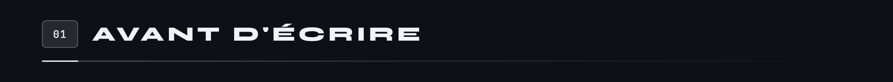

**Ouvrez une issue.** Même pour une correction d'une ligne. Une issue coûte trente secondes et répond à trois questions qui reviennent toujours six mois plus tard : qu'est-ce qu'on voulait faire, pourquoi, et qui en a décidé ainsi.

Étiquetez-la `bug`, `fonctionnalité` ou `documentation`. Si la réponse n'est pas évidente, c'est souvent que l'issue mélange deux sujets.

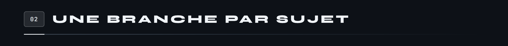

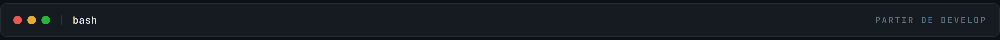

```bash
git switch develop
git pull
git switch -c feature/pilotage-fumee
```

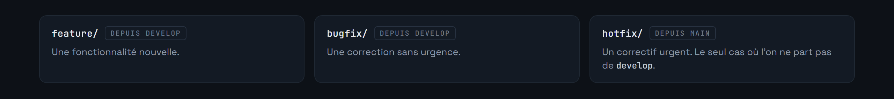

La suite du nom décrit le sujet en kebab-case. `feature/pilotage-fumee`, pas `feature/tristan-2` ni `feature/fix`.

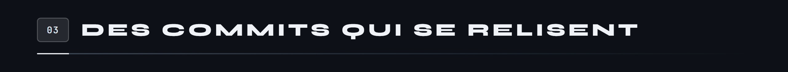

Le format est `type: description`, en français, à l'infinitif ou au présent.

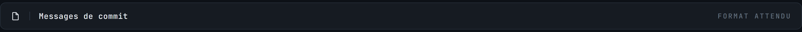

```
feat: ajout du contrôle de la machine à fumée
fix: correction de la reconnexion après coupure WiFi
docs: schéma de brochage du Launch Track
```

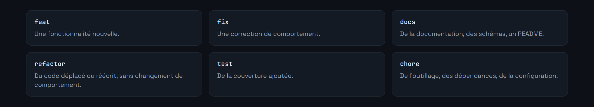

Un commit fait une chose. S'il faut écrire « et » dans le message, il y a probablement deux commits.

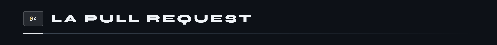

Elle revient sur `develop`, décrit ce qui change et pourquoi, et renvoie vers l'issue avec `Closes #12`.

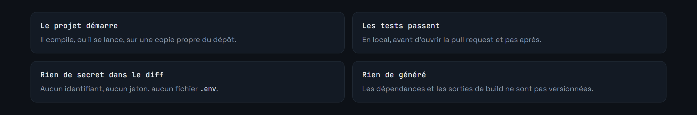

La review n'est pas une formalité. Attendez-vous à des questions, et posez-en.

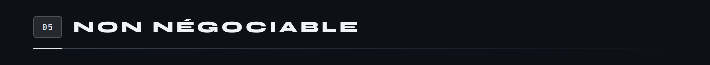

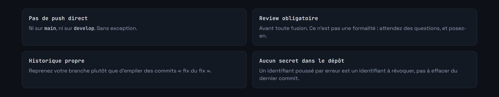

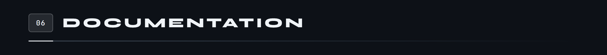

Chaque dépôt porte son README, et la règle y est la même partout : ce qui a un ordre devient une séquence, ce qui n'en a pas devient une grille, un brochage devient un schéma de carte, une hiérarchie de fichiers devient une arborescence. **Aucun tableau Markdown ne subsiste dans l'organisation.**

Chaque image porte un texte alternatif qui énumère son contenu. Une image ne se cherche pas dans la page et ne se lit pas à voix haute : le texte alternatif est ce qui compense, et c'est le prix à payer pour avoir remplacé les tableaux.


Les figures vivent dans `docs/schemas/` du dépôt concerné, les bandeaux de section dans `docs/sections/`. Les générateurs sont dans [`tools/`](tools/), avec leur mode d'emploi. Le dépôt [Template](https://github.com/Microcoaster/Template) contient le plan type d'un module.

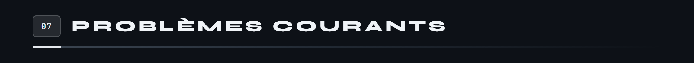

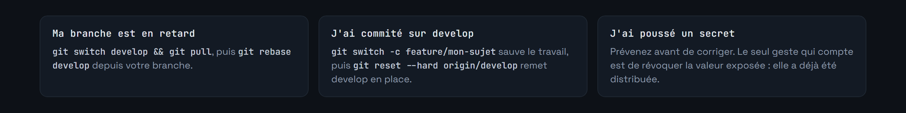

Pour le premier cas, dans l'ordre :

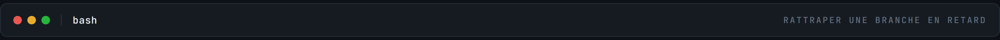

```bash
git switch develop && git pull
git switch feature/ma-branche
git rebase develop
```

Pour le second, la première commande sauve le travail sur une nouvelle branche **avant** que la seconde ne remette `develop` en place. Dans l'autre ordre, le travail est perdu.

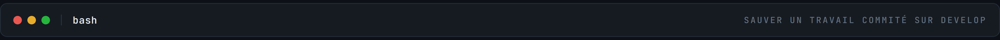

```bash
git switch -c feature/mon-sujet
git switch develop
git reset --hard origin/develop
```

---

<div align="center">


</div>
