

  
  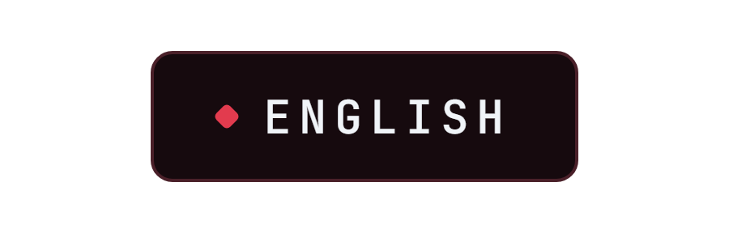

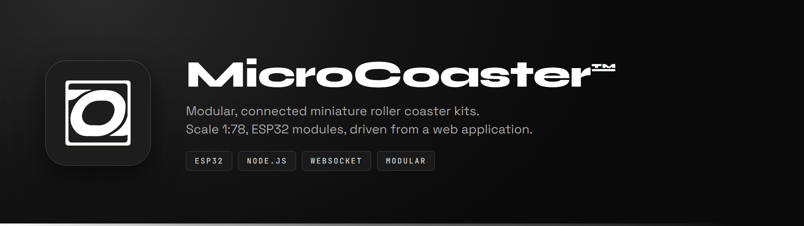

**MicroCoaster** designs and sells modular miniature roller coaster kits, at **1:78** scale, for enthusiasts, collectors and engineers. Every layout is made of standalone modules that join the network and are driven from a web application.

Founded by **Thomas Schirnhofer** in Austria · [microcoaster.com](https://microcoaster.com)

This organisation holds all the software: the control application, the ESP32 firmwares for the modules, and the community tools.

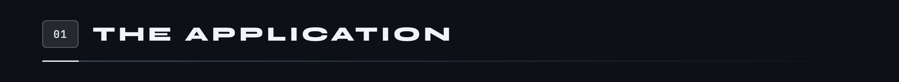

Live at **[app.microcoaster.com](https://app.microcoaster.com)**. It discovers the connected modules, shows their telemetry in real time, and lets you build timelines that orchestrate a whole layout: station dispatch, points, light effects, smoke and audio fired in the order you want.

It is also what decides. A module never starts moving on its own: it carries out an order from the server, the only one that knows the full state of the layout. That asymmetry is the design rule that holds everything else up.

**Node.js · Express · MySQL · Socket.io for the web pages · raw WebSocket for the ESP32s**

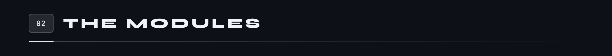

They all share the same base: an ESP32 under PlatformIO, a captive portal for joining the network, then a permanent WebSocket link to the server.

<a href="https://github.com/Microcoaster/MicroCoaster_WifiManager">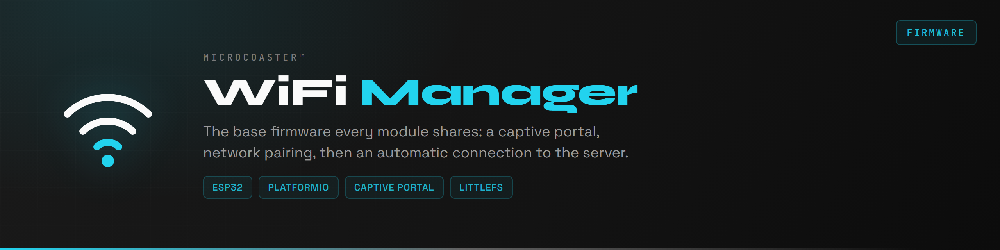</a>

<a href="https://github.com/Microcoaster/Smoke-Machine">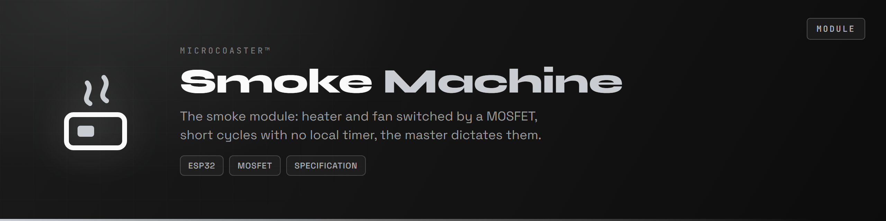</a>

Two ways of giving the train the energy it will live on: haul it to the top of a hill, or accelerate it over a few tens of centimetres. The **Lift Hill** does the first, the **Launch Track** the second.

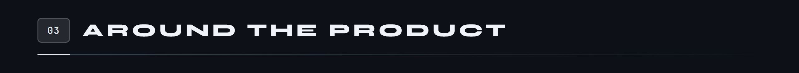

<a href="https://github.com/Microcoaster/Microcoaster-bot">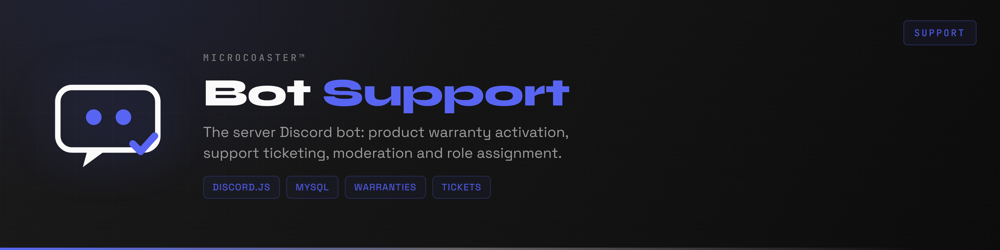</a>

<a href="https://github.com/Microcoaster/MicroCoaster_Forum">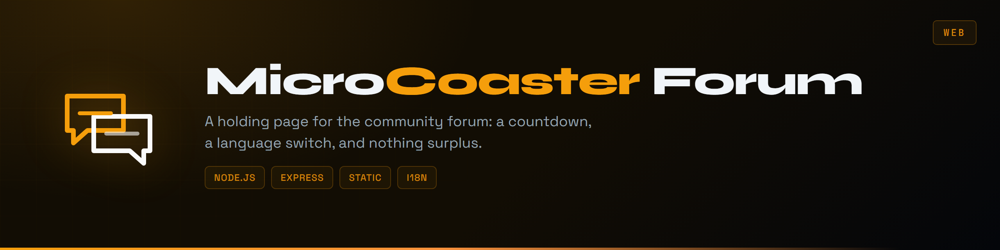</a>

The documentation and the forum do not exist yet. These two repositories hold their domains in the meantime, with a countdown and a language switch. An Express server serving static files, with no build step: a holding page that needs a toolchain is a holding page nobody dares touch again.

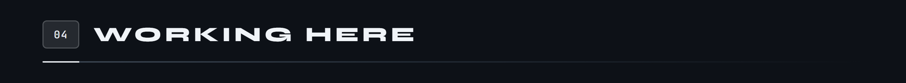

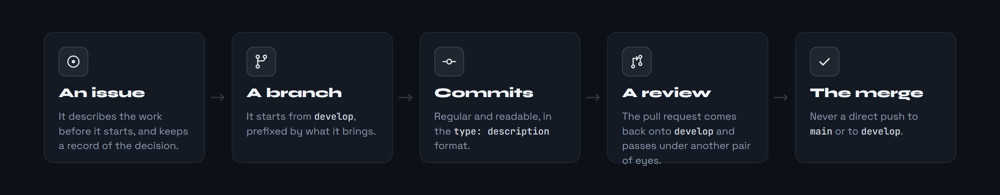

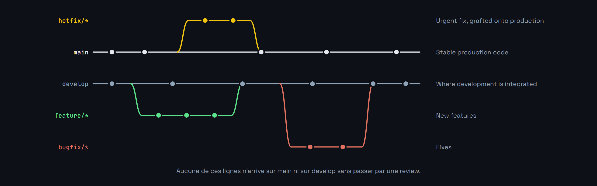

A bug spotted or an idea passing through: open an issue straight away. That is what keeps it from being forgotten, what lets it be discussed, and what keeps a record of the decision.

**Conventions.** Commits in `type: description` form, for example `feat: ajout contrôle fumée`. Branches prefixed then described in kebab-case. Issues labelled `bug`, `fonctionnalité` or `documentation`. Pull requests with a clear description and a reference back to the issue.

**Not up for discussion.** No direct push to `main` or to `develop`. Review required before merging. Local tests before opening a pull request. A clean, linear history.

The [**contribution guide**](https://github.com/Microcoaster/.github/blob/main/CONTRIBUTING.md), in French, covers the Git commands, examples of the conventions and how to get out of the usual trouble. Sitting at the root of the `.github` repository, it serves as the default guide for every repository in the organisation.

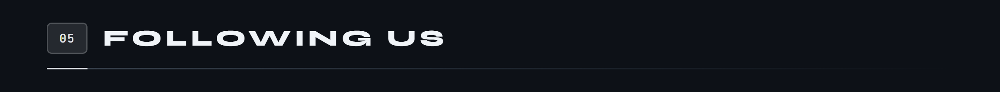

  <a href="https://microcoaster.com">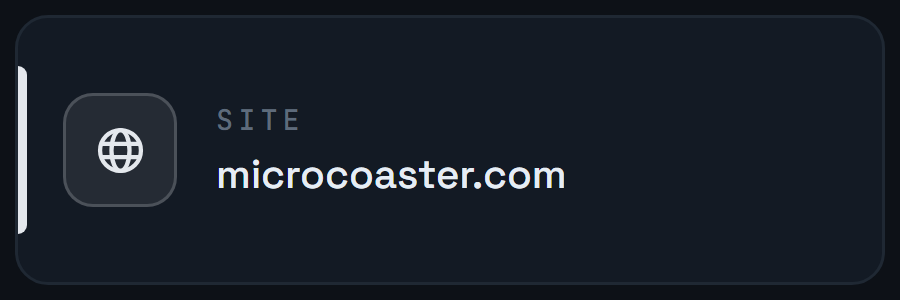</a>
  &nbsp;&nbsp;
  <a href="https://discord.gg/NXqd4eYYQf">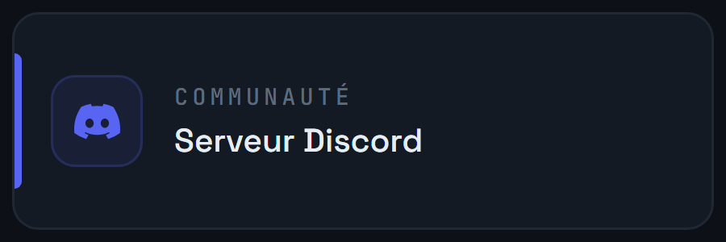</a>
  &nbsp;&nbsp;
  <a href="https://www.youtube.com/@microcoaster">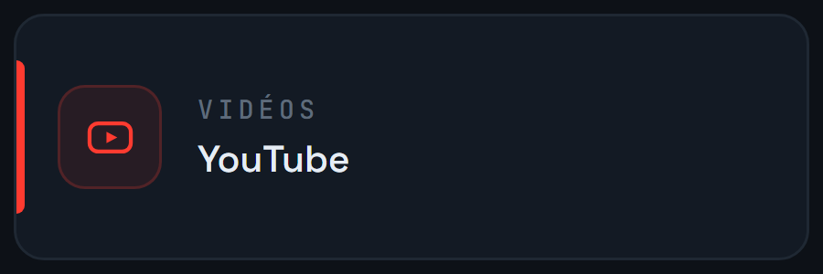</a>
  &nbsp;&nbsp;
  

  

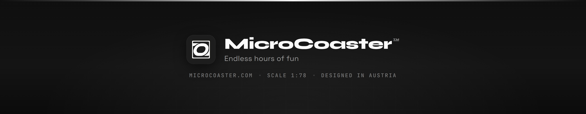
