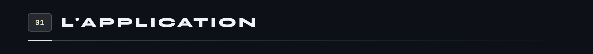
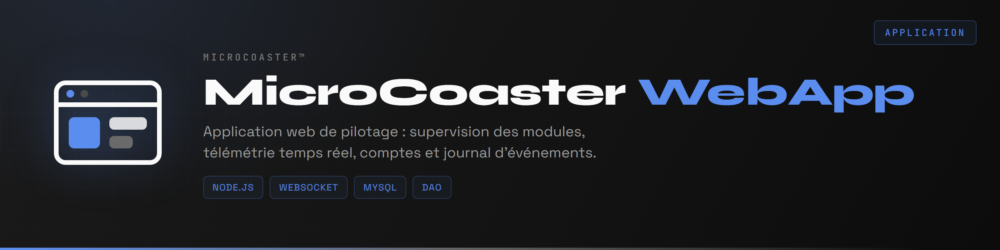
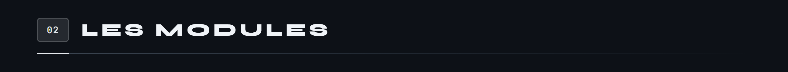
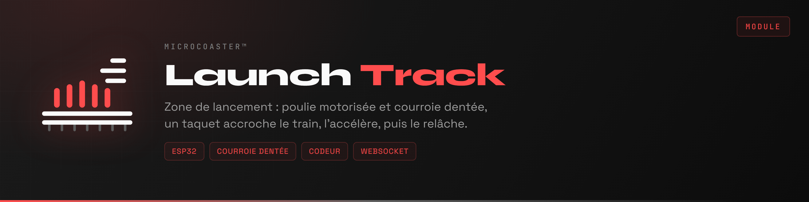
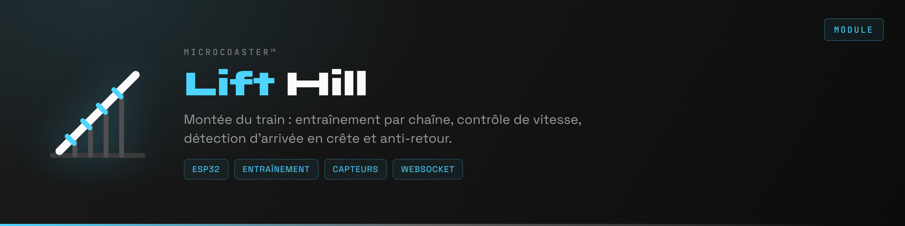
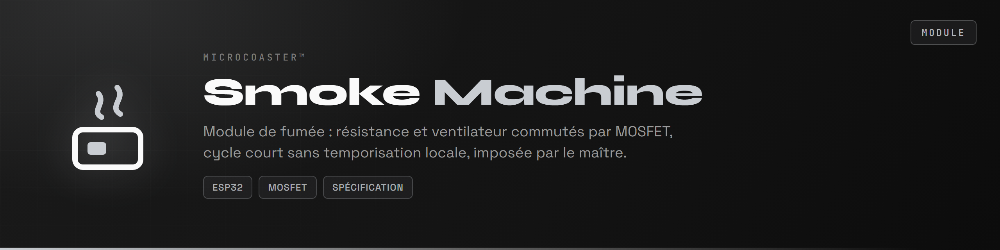
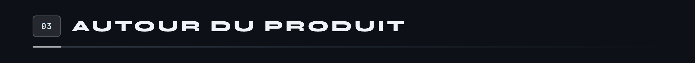
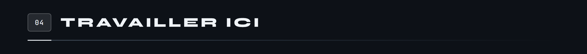
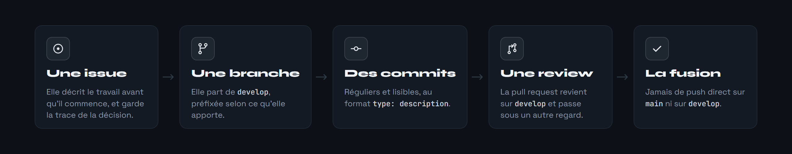
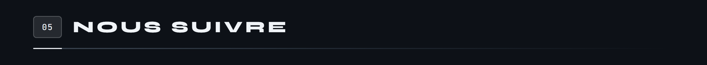

**MicroCoaster** conçoit et commercialise des kits de montagnes russes miniatures modulaires, à l'échelle **1:78**, destinés aux passionnés, aux collectionneurs et aux ingénieurs. Chaque circuit se compose de modules autonomes qui se connectent au réseau et se pilotent depuis une application web.

Fondée par **Thomas Schirnhofer** en Autriche · [microcoaster.com](https://microcoaster.com)

Cette organisation héberge tout le logiciel : l'application de pilotage, les firmwares ESP32 des modules, et les outils communautaires.

Disponible sur **[app.microcoaster.com](https://app.microcoaster.com)**. Elle découvre les modules connectés, affiche leur télémétrie en temps réel, et permet de composer des timelines pour orchestrer un circuit entier : départ de station, aiguillage, effets lumineux, fumée et audio déclenchés dans l'ordre voulu.

C'est aussi elle qui décide. Un module ne se met jamais en mouvement de lui-même : il exécute un ordre venu du serveur, seul à connaître l'état complet du circuit. Cette asymétrie est la règle de conception qui tient tout le reste.

**Node.js · Express · MySQL · Socket.io pour les pages web · WebSocket natif pour les ESP32**

Tous partagent la même base : un ESP32 sous PlatformIO, un portail captif pour l'appairage au réseau, puis une liaison WebSocket permanente avec le serveur.

Deux manières de donner au train l'énergie dont il vivra le circuit : le hisser en haut d'une montée, ou l'accélérer sur quelques dizaines de centimètres. Le **Lift Hill** fait la première, le **Launch Track** la seconde.

| Branche | Rôle |
|:--|:--|
| `main` | Code de production stable |
| `develop` | Intégration des développements |
| `feature/*` | Nouvelles fonctionnalités |
| `bugfix/*` | Corrections |
| `hotfix/*` | Correctifs urgents |

Un bug repéré ou une idée qui passe : ouvrez une issue tout de suite. C'est ce qui évite de l'oublier, ce qui permet d'en discuter, et ce qui garde une trace de la décision.

**Conventions.** Commits au format `type: description`, par exemple `feat: ajout contrôle fumée`. Branches préfixées puis décrites en kebab-case. Issues étiquetées `bug`, `fonctionnalité` ou `documentation`. Pull requests avec une description claire et un renvoi vers l'issue.

**Non négociable.** Pas de push direct sur `main` ni sur `develop`. Review obligatoire avant fusion. Tests locaux avant d'ouvrir une pull request. Historique propre et linéaire.

Le [**guide de contribution**](./CONTRIBUTING.md) détaille les commandes Git, les exemples de conventions et la résolution des problèmes courants.

 

MicroCoaster™ · Des heures infinies de fun

