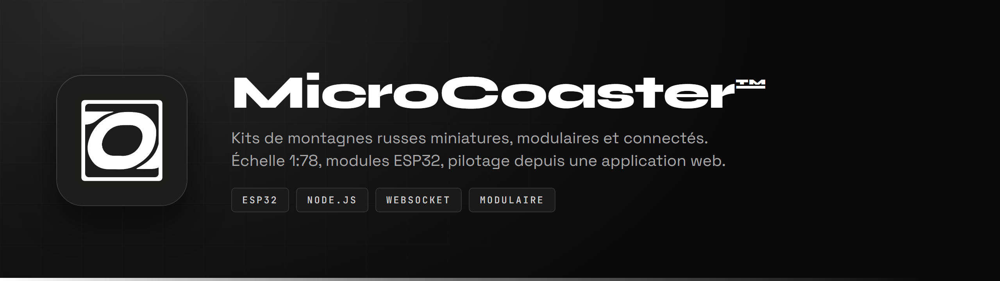
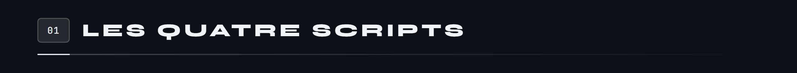
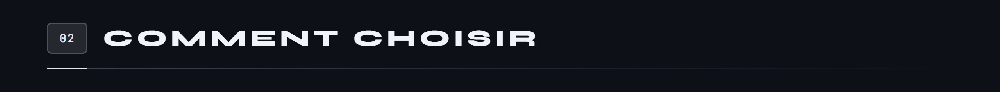
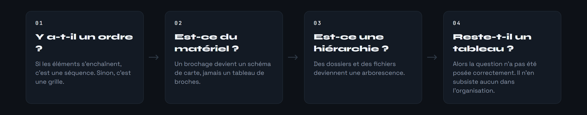
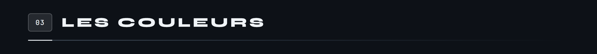
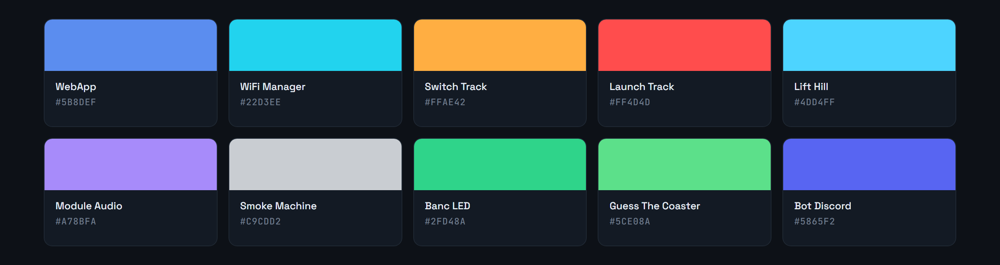
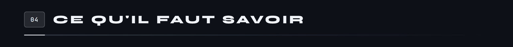
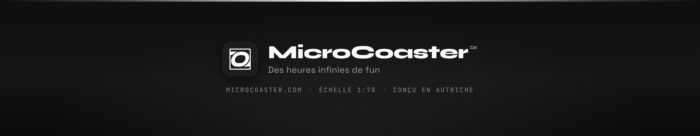

<div align="center">



</div>

# Générateurs de figures

Les READMEs de l'organisation ne contiennent aucun tableau Markdown. Ce qui serait un tableau est dessiné, et ces cinq scripts produisent les images.

Ils tournent sous Git Bash et n'ont besoin que d'une chose : Chrome, qui sert de moteur de rendu.

```bash
export CHROME="/c/Program Files/Google/Chrome/Application/chrome.exe"   # si le chemin diffère
```




**Les bandeaux de section.**

```bash
source tools/sections.sh
rep switchtrack "#FFAE42" "Principe" "Matériel" "Protocole" "Mise en service" "Écosystème"
```

Sortie dans `sec/`. Copiez les fichiers dans `docs/sections/` du module, renommés `s01.png` et suivants.

**Un brochage.** Chaque entrée s'écrit `GPIO|Nom|Rôle`, et `--` sépare la colonne de gauche de celle de droite.

```bash
source tools/pinout.sh
pinout lift "#4DD4FF" "ESP32<br>LIFT HILL" \
  "SORTIES · CE QUE LE MODULE COMMANDE" "ENTRÉES · CE QUE LE MODULE MESURE" \
  "25|Moteur, PWM|Vitesse de la chaîne" \
  -- \
  "34|Capteur Hall|Une impulsion par tour"
```

**Une séquence.**

```bash
source tools/seq.sh
seqfig st-principe "#FFAE42" \
  "Ordre reçu|Le serveur envoie <code>switch_left</code>." \
  "Vérin actionné|Le sens est imposé au DRV8871."
```

**Une grille.** Le troisième argument est le nombre de colonnes. Une entrée peut porter un badge : `"NOM|BADGE|description"`.

```bash
source tools/grid.sh
grid lift-cfg "#4DD4FF" 2 \
  "RAMP_MS|Douceur du départ et de l'arrivée en crête." \
  "LIFT_TIMEOUT_MS|Durée maximale d'une montée avant défaut."
```

**Une arborescence.** Le premier champ est la profondeur, `1` pour un enfant direct de la racine. Un nom qui se termine par `/` est un dossier.

```bash
source tools/tree.sh
treefig bot "#5865F2" "Microcoaster-bot/" \
  "1|dao/|L'accès à la base, une classe par domaine." \
  "2|warrantyDAO.js|Codes, activations et échéances."
```

**Les tuiles de liens**, à part : elles ne remplacent pas un tableau mais les cartes du bas de page. Un carré de 288 pixels au gabarit de skillicons.dev, affiché à 72, pour que le bloc « Nous suivre » parle la même langue que les rangées de stack.

```bash
source tools/liens.sh
pack discord              # la tuile skillicons telle quelle
marque youtube "#FF0000"  # un logo Simple Icons, en blanc sur la marque
logo site                 # le logo MicroCoaster, détouré
adresse adresse "microcoaster.com"
```

La rangée se limite à quatre tuiles : le site, puis Discord, YouTube et Instagram. L'application, la documentation et le forum vivent déjà dans le corps de la page ; les redire en bas ne leur ajoutait qu'une icône de plus à distinguer.

`tools/profil-liens.sh` produit la rangée publiée telle quelle.





Une machine à états ne passe par aucun de ces quatre scripts : elle se dessine à la main, en reprenant les styles de `seq.sh`. Voir [Launch Track](https://github.com/Microcoaster/Launch-Track) et [Lift Hill](https://github.com/Microcoaster/Lift-Hill).



L'accent vient de la bannière du dépôt, et un dépôt garde la même couleur de haut en bas.



La page d'organisation et le guide de contribution utilisent `#E4E8ED`, un gris neutre : ils parlent de l'organisation, pas d'un produit.



**Chaque figure porte un texte alternatif qui énumère son contenu.** Une image ne se cherche pas dans la page et ne se lit pas à voix haute. C'est le prix à payer pour avoir remplacé les tableaux, et il n'est pas négociable.

**Ne jamais écrire de chiffres en police Syne.** Ses numéraux sont mauvais, `ESP32` y devient illisible. Les marquages de carte sont en JetBrains Mono.

**Chrome est appelé deux fois par `grid.sh`, `seq.sh` et `tree.sh`.** La hauteur d'une figure dépend du repli des textes, qui n'est pas devinable à l'avance. La première passe laisse la page écrire sa hauteur réelle dans son `<title>`, que `--dump-dom` renvoie ; la seconde prend la capture à cette hauteur exacte. C'est ce qui évite les marges mortes en bas et les contenus coupés.

**`--virtual-time-budget` est obligatoire.** Sans lui, Chrome capture avant le chargement des polices et la figure sort dans une police de repli. L'erreur ne se voit qu'en comparant deux images côte à côte.

Le rendu se fait à `--force-device-scale-factor=2` sur une largeur de 1280 pixels. Les tuiles de `liens.sh` font exception : elles sont dessinées à 288 pixels pleins, sans facteur d'échelle, puis affichées à 72. Un logo n'a pas de texte à préserver, seulement des courbes, et quatre fois la taille d'affichage suffit à les garder nettes sur un écran dense.

**Le chemin des scripts vient de `BASH_SOURCE`, pas de `$0`.** Ils sont faits pour être chargés par `source` : `$0` désigne alors le shell appelant, et les figures atterrissent dans le dossier courant au lieu de `tools/`. C'est ainsi que des dossiers `html/` et `sec/` se sont retrouvés commités dans un dépôt de module.

---

<div align="center">



</div>
